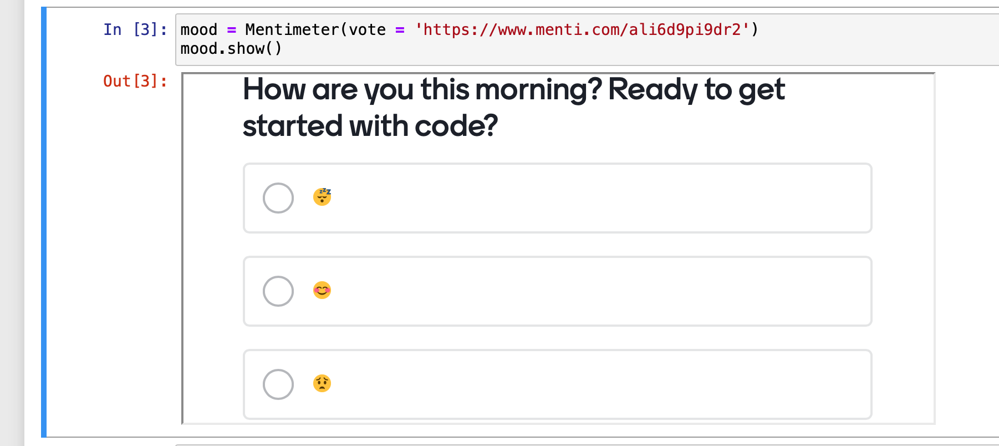

# Summary

Data-Driven Chemistry is a course aimed at undergraduate students in chemistry with no prior knowledge of programming and programmatic data analysis. It is designed as a 10-week-long course,^[This is a 20 SCQF credit course including assessments, roughly equivalent to 10 ECTS or 5 US credits] introducing Python programming and its usage in data analysis typically required for a Chemistry degree. The course consists of 10 Units, designed to be used in a blended learning environment of live coding and explanations, followed by a set of in-course tasks to be solved individually or through pair programming.
Generally, we aimed to follow Software Carpentry [@wilson-software-carpentry] teaching philosophy as closely as possible for each Unit. While, in principle, this course is designed to be taught as a whole, each Unit will cover a set of self-contained topics. The idea behind the modular design is to make the reuse and mix-and-match with other courses as easy as possible.
The original material is hosted online using the [Noteable](https://noteable.edina.ac.uk/) service provided by the University of Edinburgh, but to make it available outside of the University of Edinburgh, we have migrated the content to [Google CoLab](https://colab.research.google.com). The online hosting on CoLab will enable self-guided learning, as well as classroom-based learning, ensuring that the learning is not only limited to a university classroom setting.

# Statement of Need

The modern world is digital, allowing for upscaling and automation of chemical processes through robots, but also fast production of large-scale datasets. Data analyses carried out with Graphical User Interfaces (GUIs) or spreadsheet-based tools are often limited in robustness, speed, and reproducibility. Programmatic solutions fare much better in this context, but programming is not typically taught as a skill across chemistry degrees, unlike in physics, mathematics, or even biology [@white2022data]. Both the Royal Society of Chemistry [@employability] and the American Chemical Society [@neiles2020professional] have identified good computational skills to be a key for graduate employability [@hill2019undergraduate]. Our course is designed to address this gap in the undergraduate chemistry curriculum at the University of Edinburgh and, thus, to ensure that chemistry graduates remain competitive with other STEM graduates. The material is made available as open source, with the hope that it may be used in other educational settings.

In recent years, programming has been integrated into chemistry degrees as a course on _Mathematics for Chemists_ [@hutchison2021integrating]. While this approach provides a good foundation of programming, students are often left with few applications or examples relevant to their specific degree. There are excellent resources for self-study through books [@tanemura2022python] as well as more general material for self-study of Python programming. Some material exists for a general introduction to programming and data analysis with a focus on, for instance, physical chemistry [@baptista2021using], analytical chemistry [@menke2020series], or machine learning for chemistry [@lafuente2021gentle]. However, little material is available for complete novices that combines teaching the basics of Python programming with how it can be applied to data in physical, inorganic, analytical, and even organic chemistry. The presented course fills this gap. 

# Overview, Content, and Structure
## Target Audience 

The course is aimed at early-year undergraduate students in Chemistry, either first or second year, with little or no programming background in Python or other languages. The cohort size is typically around 100 students. During the first lecture, the 2022/23 cohort was asked the question: "Do you know how to code?". 
Overwhelmingly (62%), students replied with "I have no prior coding experience", while an additional 30% replied - "I only have some basic Python or coding experience". Only one respondent answered that they were confident in the use of Python. 

By the end of the course, students should be proficient in using Python to:

- Break a problem into logical steps, and use loops and decision operations to solve tasks;
- Perform numerical operations such as vector algebra and calculate simple statistics on data sets;
- Read and clean experimental data, visualise the data and draw appropriate conclusions from the data through simple statistical analysis;
- Fit models to numerical data and present results in a clear and well-documented manner;
- Write readable, well-documented short snippets of code for data analysis making use of functions, loops and conditionals.

## Content

The course is structured similarly to [@muller2022pcp]. Data-Driven Chemistry consists of 10 Units, each designed as a 3-hour workshop session, either in-person or online. Additional tasks are provided for completion after the workshop sessions. 
A summary of each unit can be found in Table 1 below:

| Unit | Content Summary                 | Materials |
|------|---------------------------------|-----------|
| 01    | An Introduction to algorithmic thinking and using Jupyter notebooks              |[Link to Notebook](https://github.com/Edinburgh-Chemistry-Teaching/DDC/blob/main/Unit_01/Unit_01_problem_solving_I.ipynb)|
| 02    | Variables (`int`, `float`, `string`), lists, dictionaries and tuples in Python|[Link to Notebook](https://github.com/Edinburgh-Chemistry-Teaching/DDC/blob/main/Unit_02/Unit_02_variables_I.ipynb) |
| 03    | Loops and conditional statements                                                  |[Link to Notebook](https://github.com/Edinburgh-Chemistry-Teaching/DDC/blob/main/Unit_03/Unit_03_loops_I.ipynb) |
| 04    | Functions and basic Input/Output                                        |[Link to Notebook](https://github.com/Edinburgh-Chemistry-Teaching/DDC/blob/main/Unit_04/Unit_04_functions_I.ipynb) |
| 05    | An introduction to plotting, using units and statistical analysis                    |[Link to Notebook](https://github.com/Edinburgh-Chemistry-Teaching/Data-driven-chemistry/blob/main/Unit_05/Unit_05_I_numerical_data.ipynb)  |
| 06    | Comparison of distributions, t-tests and working with molecular geometries             |[Link to Notebook](https://github.com/Edinburgh-Chemistry-Teaching/DDC/blob/main/Unit_06/Unit_06_statistics_I.ipynb) |
| 07    | Correlations in data and model fitting                                  |[Link to Notebook](https://github.com/Edinburgh-Chemistry-Teaching/DDC/blob/main/Unit_07/Unit_07_fitting_I.ipynb) |
| 08    | Applications I: Finding peaks in mass spectrometry data, fitting radioactive decay pathways and writing a chemistry quiz                                                        |[Link to Notebook](https://github.com/Edinburgh-Chemistry-Teaching/DDC/blob/main/Unit_08/Unit_08_Applications_I.ipynb) |
| 09    | Applications II: Working with UV-Vis and small angle X-ray scattering (SAXS) data                                                        |[Link to Notebook](https://github.com/Edinburgh-Chemistry-Teaching/Data-driven-chemistry/blob/main/Unit_09/Unit_09_applications_II_part_I.ipynb)|
| 10   | Applications III: Nuclear magnetic resonance (NMR) data                                                       |[Link to Notebook](https://github.com/Edinburgh-Chemistry-Teaching/DDC/blob/main/Unit_10/Unit_10_NMR_application_student.ipynb)|
*Table 1: Summary of course material.*

The content is grouped into three main parts. `Unit_01` to `Unit_04` introduces concepts around algorithmic thinking and Python syntax, including variables, loops, functions, libraries, documentation, how to get help, and how to read files. These were largely adapted from [Plotting and Programming in Python](http://swcarpentry.github.io/python-novice-gapminder/). `Unit_05` to `Unit_07` introduce concepts from SciPy [@virtanen2020scipy], NumPy [@harris2020array], Matplotlib [@hunter2007matplotlib] and Pandas [@team2022pandasdev] to carry out basic statistical analysis and plotting of chemistry-related data. Our strategy was to incorporate as many chemistry topics or techniques already familiar to students while teaching new Python content. For example, we assume that students have already studied mathematical concepts such as fitting data and comparing distributions, but now are presented with a dataset relevant to their degree. The domain-specific twist aims to boost motivation in students to engage with these mathematical concepts. Therefore, `Unit_08` to `Unit_10` cover specific application examples from different areas of chemistry, and some of the applications directly tie into the students' lab experiments (*e.g.* UV-Vis spectroscopy and NMR data). 
To ensure sufficient support to students, at each 3-hour long workshop attended by around 100 learners, ten teaching assistants were available. Furthermore, 1-hour long Q&A sessions with the teaching assistants were organised on alternate weeks.  

# Assessment and feedback

The course was formally assessed at the University of Edinburgh using NBGrader [@jupyter2019nbgrader]. It was important to initially test the students formatively with weekly online quizzes, which could be completed multiple times. This gave students instant feedback on their performance, and allowed them to improve. In later weeks, the course was assessed summatively. However, we still made use of informal feedback within the sessions with built-in quizzes in the Jupyter Notebooks using [Mentimeter](https://www.mentimeter.com) and an associated Python Class. We polled students to test their understanding of the material, to promote critical thinking, and check their background knowledge. We also used Mentimeter to gather feedback after each session, which helped us to improve the material further. Generally, the usage of embedded quizzes helped with engagement from students. Figure 1 shows an example of a Mentimeter quiz.   

*Figure 1: Example of how a Mentimeter poll can be directly embedded into a Jupyter notebook using the provided `Mentimeter` class.*

# Conclusion

We present a modular course to teach Python for chemistry undergraduate students, targeted at complete novices. We hope it is of value to other Chemistry students and educators. Running the material through CoLab removes all installation requirements, making the course more easily accessible to novices - from students in guided university settings to other chemistry enthusiasts. 

# Author's Contribution

Authors are listed in alphabetical order; specific contributions by each author are found in the following: James Cumby (JC), Valentina Erastova (VE), Claire L. Hobday (CLH), and Antonia Mey (ASJSM) have been teaching this course at the University of Edinburgh since the academic year 2021/22. See below for their detailed contributions. Rafał Szabla (RS) taught one unit and created content for it in 2020/21, when the course was run in a shortened form as a replacement for physical chemistry laboratory practicals during the pandemic. Matteo T Degiacomi (MTD) shared materials, developed in 2018 for his course at Durham University aimed at chemistry research students from which material was adapted. He made some additional contributions beyond his original material.

**JC:** Is the course organiser for the module taught at the University of Edinburgh and created the material for `Unit_01`, `Unit_10` and the `helper_functions`, gave feedback on other materials, and helped edit the manuscript.   
**MTD:** Contributed material to `Unit_03`, `Unit_05` and `Unit_08`, and helped edit the manuscript.    
**VE:** Created material for `Unit_05` and `Unit_08`, contributed to `Unit_06`, and helped edit the manuscript.   
**JJG:** Contributed material to `Unit_09`, and helped edit the manuscript.    
**CLH:** Created material for `Unit_03` and `Unit_04`, and helped edit the manuscript.   
**ASJSM:** Created material for `Unit_02`, `Unit_06`, `Unit_07`, and `Unit_09`, provided feedback and small contributions to most other units, and wrote the manuscript.    
**HP:** Contributed material to `Unit_05` and  `Unit_08`, and helped edit the manuscript.    
**RS:** Created the material for molecular geometries forming part of `Unit_06` and gave feedback on the manuscript. 

# Acknowledgements 

We would like to acknowledge Software Carpentries for material and inspiration and all PhD student demonstrators who helped with teaching the material, giving feedback and creating some of the assignments.

# References
